# RustCrackMe

A simple program designed as a CrackMe. 

### How to use it

Since the code for this program is available in this repository, you can compile and crack it yourself.

First, you need to clone the repo and go into his directory

```bash
git clone https://github.com/CodingLikeABaby/RustCrackMe.git
cd RustCrackMe
```

After that, you can simply run it using cargo

```bash
cargo run
```


## Solution

If you are having trouble completing it, here is the solution.


First, let's launch the program to see how he behaves.

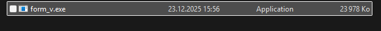

As we can see below, the program asks us for a key to access its content.

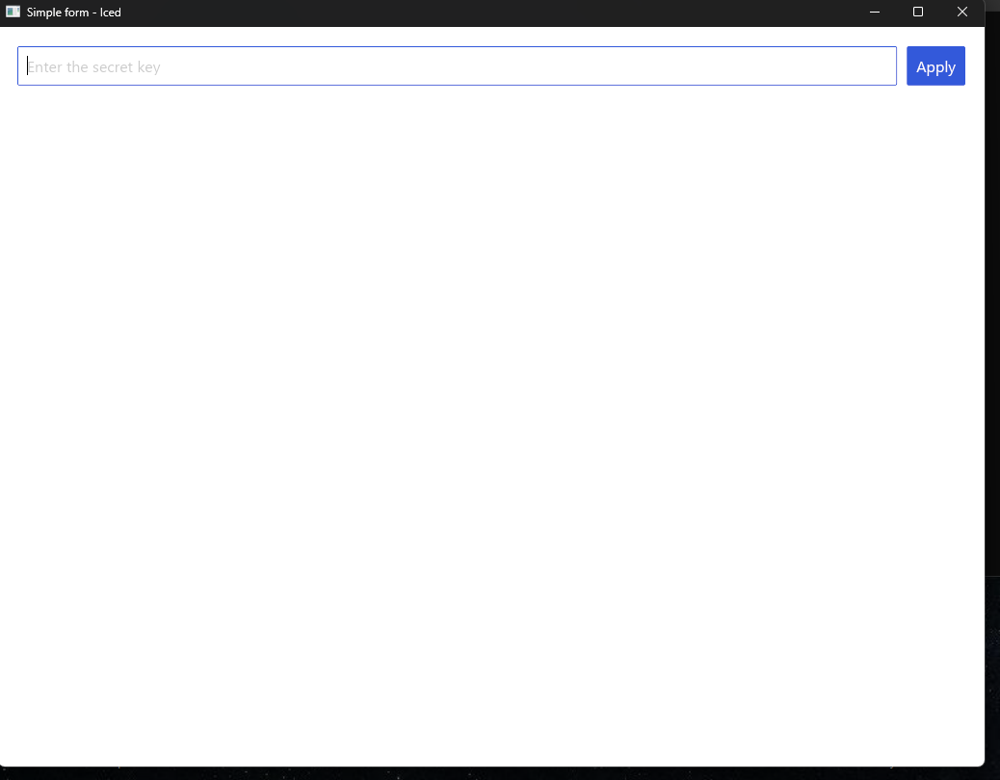

If we enter an incorrect key, an error message appears.

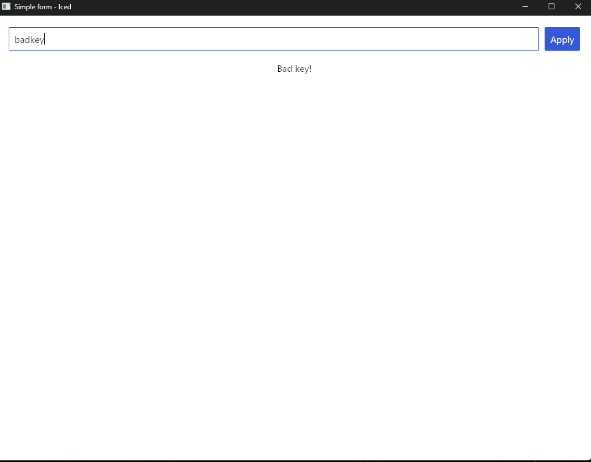

but if we enter the correct one (secr3tk3y), we can access the application, which is actually a base64 encoder.

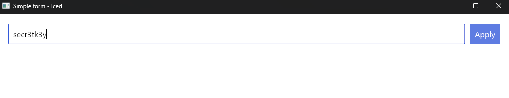

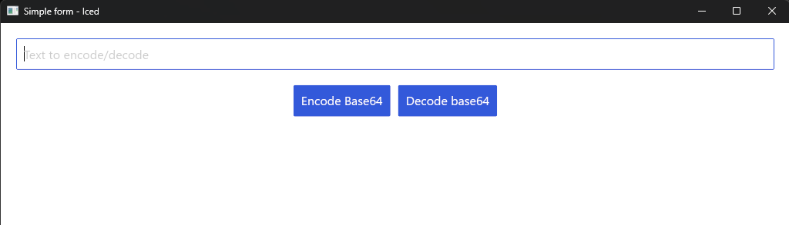


Under normal circumstances, we probably wouldn't know this key. Let's find a way to bypass it.

In this example, we will use x64 dbg (a free software).

Let's load our program inside.

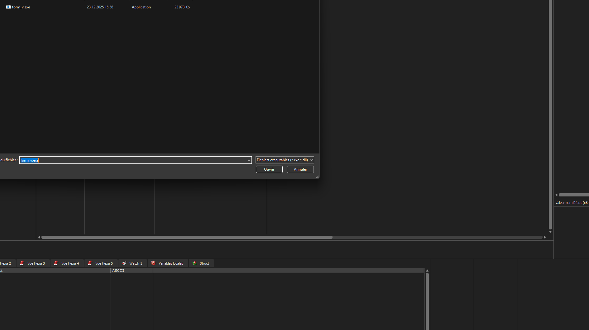

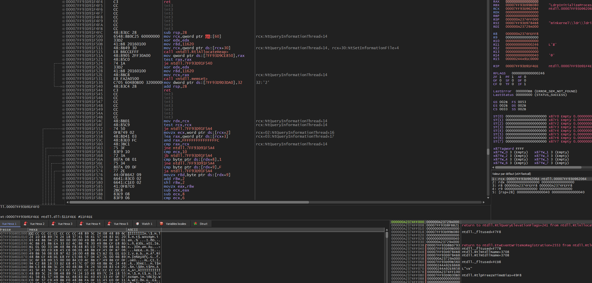

As you can see, although fairly simple, the program is quite long in a debugger.


Most of the time, certain character strings remain hard-coded. Let's try to find them. 

We already know one: “Bad key.” To do this, we right-click > search for > all > character strings.

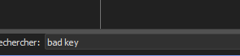

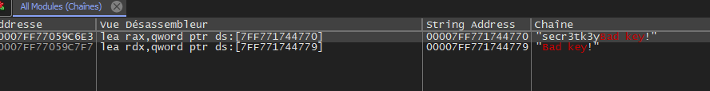

We have two results. The first one is rather strange, but the second one is quite clear. Let's take a look. 

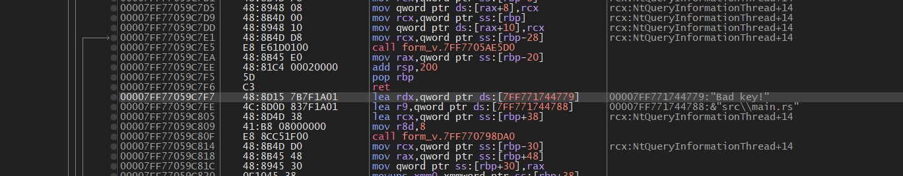

We don't need advanced knowledge of assembly language to understand that this line is largely responsible for displaying the error message. 

This means that the condition that determines whether it is displayed, the one that checks the key, must be a little higher up.

let's go a bit higher

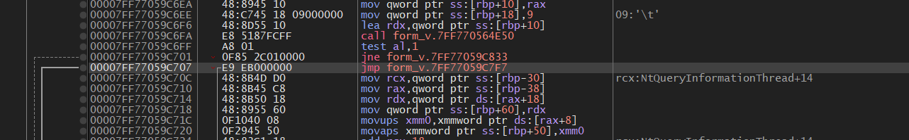

Here we are! We have a `jne` (jump if not equal) condition followed by a `jmp` (jump). 

In this type of condition, we often see a `jne` or `je` (jump if equal) followed by a `jmp`, which acts as an `else`.


This seems strange, because the key is verified as follows: `if self.input_value == secretkey`. 

It would therefore be logical to find the instruction `je` rather than `jne`. In reality, this is an inversion that often occurs during compilation and is not a problem.


So what should we do now?

We simply need to reverse the condition so that when the user types an invalid key, they gain access to the application. x64 dbg allows us to do this easily. `jne` then becomes `je`.

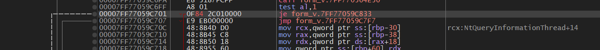

Okay, now let's create a patch. A patch is a modified version of the base application.

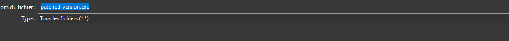


Now, let's launch the app and try to insert an incorrect key.

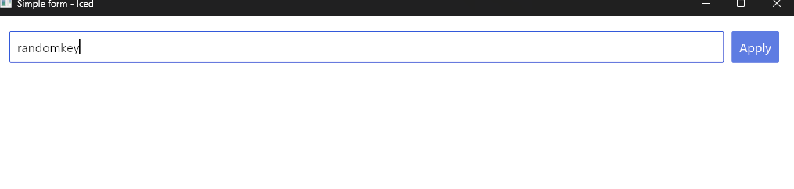

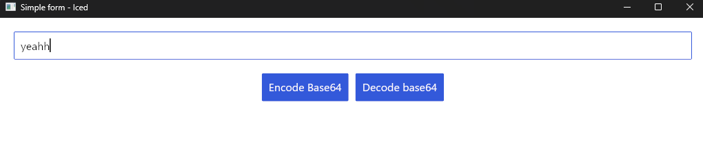

That's it! We have successfully cracked the program, allowing us to access its content with an incorrect key without knowing the real one.


## Disclaimer

You now know that even in a compiled program, certain information remains accessible and nothing prevents us from making changes to it and then patching it. 
Not only is cracking programs that you do not own illegal, but it can also put you at risk and undermine the work of developers. 
In fact, while we simply reversed a condition to access the program in this example, it is entirely possible to add entire functions. Therefore, always be careful about what you download and make sure you always use the official program from a brand.


